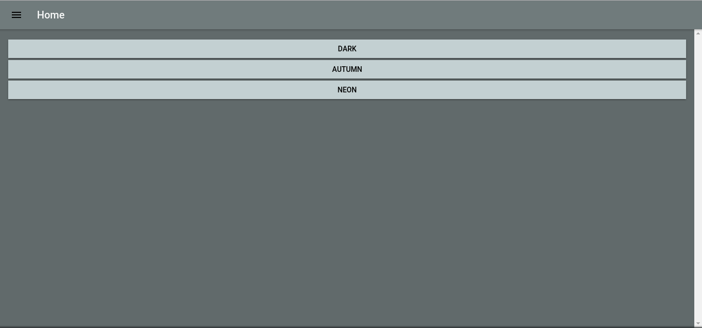
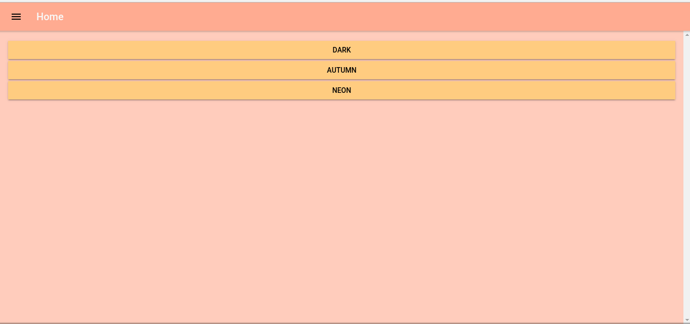
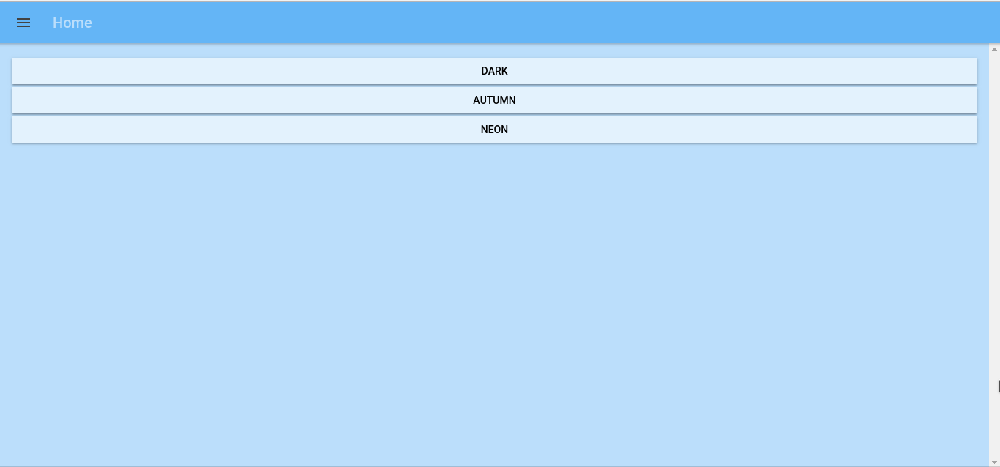

# Ionic 3 Dynamic Theme

## Representation

There are three different themes in the application and they can be dynamically changed to each other.
Following screenshots are a representation for this feature.

## Examples: 

<b>Dark:</b>

<b>Autumn:</b>

<b>Neon:</b>

### There will be more features soon